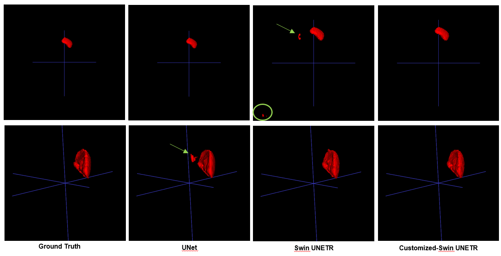

# 3D-splenomegaly-segmentation

This repository contains code for the study:

**Automated Spleen Segmentation for Splenomegaly in Cancer Patients’ CT using Customized Swin UNETR and Post-processing**  
📄 *Preparing*  

## 🧠 Abstract

> This study proposes an automatic segmentation and post-processing method for accurately measuring spleen size changes in cancer patients. To address the problem of decreased accuracy in existing deep learning-based segmentation models for patients with enlarged spleens after chemotherapy, we customized a Swin UNETR based 3D segmentation model and performed post-processing based on background masking and connected component analysis. Applying the proposed method to clinically acquired abdominal CT data, the proposed method showed improved accuracy in performance metrics such as Dice Similarity Coefficient (DSC) and Hausdorff Distance (HD) compared to existing deep learning models. The method developed in this study is expected to be utilized as an effective tool for quantitatively evaluating spleen volume changes in cancer patients.

---

  

---

## 📁 Files

- `test.py` : Test script for splenomegaly segmentation.
- `postprocess.py` : A script for applying post-processing.
